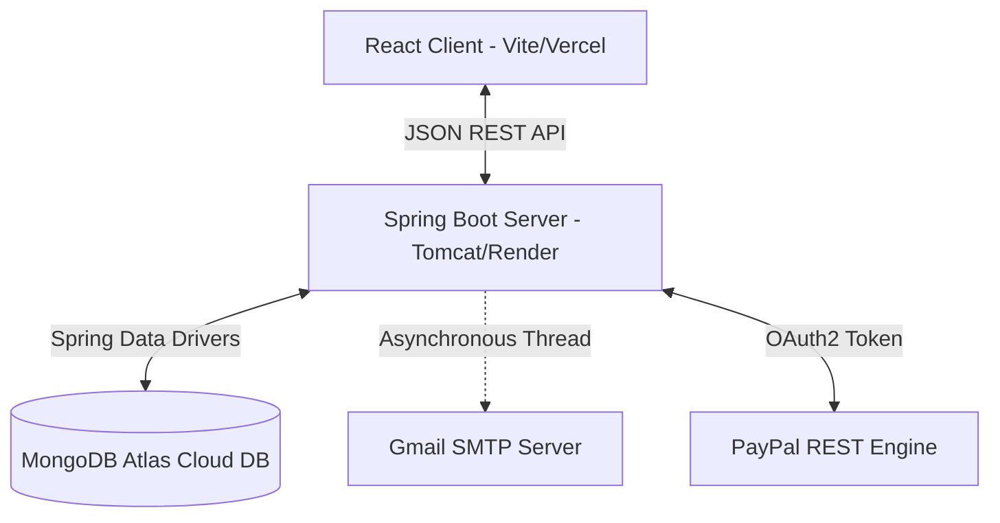

# 🏡 PG Made Eazy — Premium Coliving & PG Accommodation Finder

[](https://www.oracle.com/java/)
[](https://spring.io/projects/spring-boot)
[](https://react.dev/)
[](https://vite.dev/)
[](https://www.mongodb.com/)
[](https://developer.paypal.com/)

**PG Made Eazy** is a state-of-the-art, full-stack web application designed to connect students and working professionals with verified PG (Paying Guest) accommodations. Featuring a fully decoupled React SPA frontend, an asynchronous Spring Boot REST API backend, and PayPal sandbox integrations, it removes the broker from the accommodation search process.

---

## ✨ Features

### 👤 Seeker (Tenant) Features
* **Dynamic Search & Filters**: Search listings by locality/area, city, price range, categories (Boys, Girls, Unisex), and specific amenities (WiFi, Power Backup, AC, Food).
* **Indefinite Monthly Bookings**: Toggle open-ended monthly rentals which auto-lock stays to 30-day billing intervals.
* **Dual Payment Gateways**: Reserve rooms online using **PayPal Sandbox** or offline via **Pay Owner (Cash)**.
* **My Bookings Dashboard**: Track reservations with active statuses like `PENDING` (for owner verification) or `CONFIRMED`.
* **Favorites/Saved PGs**: Save listings to a personal wishlist for quick review.

### 🏢 Provider (Owner) Features
* **PG Listing Management**: Add new PG hostels, upload rooms images, define rules (e.g. curfews), and set amenity checklists.
* **Dashboard Stats**: View total listings, active bookings, occupancy rates, and pending requests.
* **Request Management**: Approve or reject seeker booking requests directly from the dashboard.

### 👑 Admin Features
* **Global System Control**: Verify and approve provider properties before they appear on the public search index.

---

## 🛠️ Technology Stack

* **Frontend**:
  * React (18.x) & Vite (Client-side compilation)
  * Tailwind CSS (Premium Dark Theme & UI elements)
  * Lucide Icons & React Hot Toast (Notifications)
  * js-cookie (JWT Session persistence)
* **Backend**:
  * Java 17 & Spring Boot (3.x)
  * Spring Security & JWT Token Authentication
  * Spring Data MongoDB (Atlas integration)
  * JavaMailSender (Asynchronous SMTP notification engine)
* **Database**:
  * MongoDB Atlas Cloud Database

---

## 🏗️ System Architecture



---

## ⚙️ Setup & Installation

### Prerequisite Environment Variables
Before running the application, make sure the following variables are configured:

#### Backend Settings (`application.properties`)
* `spring.data.mongodb.uri`: Your MongoDB Atlas Connection URI string.
* `spring.mail.username` / `spring.mail.password`: Your Google SMTP app credentials.
* `paypal.client.id` / `paypal.client.secret`: Your PayPal Developer Sandbox credentials.

#### Frontend Settings (`.env` or Vercel Config)
* `VITE_API_URL`: The URL of your running backend server (e.g., `http://localhost:8080` or your Render domain).

---

### Running Locally

#### 1. Start the Backend
1. Open the project in VS Code.
2. Navigate to: `backend/src/main/java/com/pgmadeeazy/PgMadeEazyApplication.java`
3. Click **"Run"** above the main method (requires the *Extension Pack for Java* extension).
4. The server starts on **`http://localhost:8080`**.

#### 2. Start the Frontend
1. Open a new terminal in your VS Code.
2. Navigate to the frontend folder:
   ```bash
   cd frontend
   ```
3. Install dependencies:
   ```bash
   npm install
   ```
4. Run the Vite development server:
   ```bash
   npm run dev
   ```
5. Click the link **`http://localhost:5173`** to test it locally.

---

## 🚀 Deployed Environments
* **Frontend Site**: [https://p-gmade-eazyyy.vercel.app/](https://p-gmade-eazyyy.vercel.app/)
* **Backend API**: [https://pgmadeeazy-backend.onrender.com/](https://pgmadeeazy-backend.onrender.com/)

---

## 📜 License & Author
* **Project Owner**: Praveen Prakash ([praveen01-pr](https://github.com/praveen01-pr))
* Developed under the open-source licensing guidelines.
